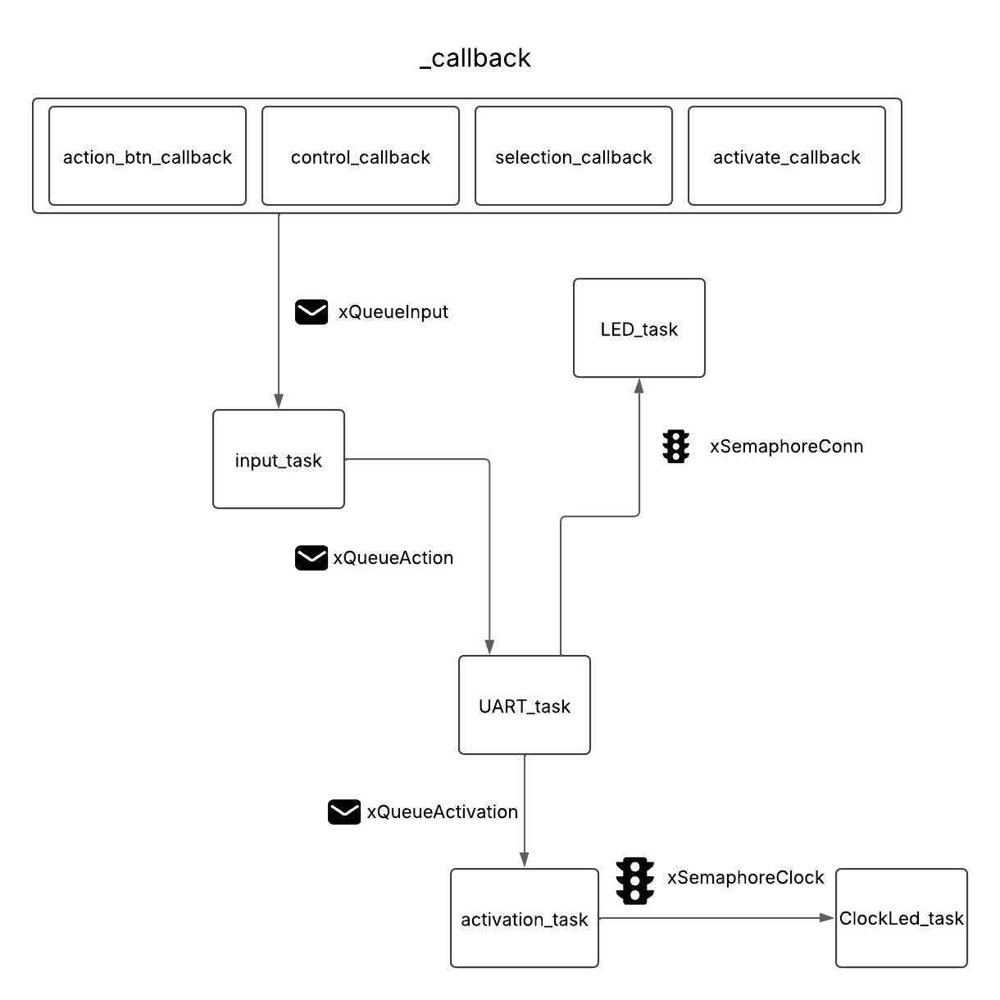

# APS 2 - Controle Ultimatrix 

## Jogo
**[Ben 10: Protector of Earth](https://ben10.fandom.com/pt-br/wiki/Ben_10:_Protector_of_Earth)** - O jogo conta a história de um jovem garoto que tem um relógio capaz de se transformar em diversos aliens. Nesse jogo ele descobre que alguns de seus aliens foram roubados por Vilgax e precisa recupera-los.

## Ideia do Controle
O controle será inspirado em um dos relógios que Ben 10 utiliza, o [Ultimatrix](https://ben10.fandom.com/wiki/Ultimatrix_(Original)), a partir dele o jogador podera escolher seus aliens como o Ben ao rodar o relógio e se transformar neles ao apertar o centro. Além disso, também será possível controlar o personagem, atacar e 

## Inputs e Outputs
### **Entradas (Inputs)**
- **Joystick analógico:** Para movimentação do personagem.
- **Potenciômetro:** Para alternar entre os itens da hotbar.
- **6x Entradas Digitais:**
  - Botão de Ataque Especial
  - Botão de Ataque Leve
  - Botão de Ataque Pesado
  - Botão de Defesa
  - Botão de Pause
  - Botão de Ativar o Omnitrix

### **Saídas (Outputs)**
- **LED indicador de conexão**
- **LED de Ativação do Omnitrix**

## Protocolo Utilizado
- **UART (Universal Asynchronous Receiver-Transmitter)** para comunicação entre o controle e o computador.
- **GPIO Interrupts** para os botões e entradas digitais.

## Diagrama de Blocos Explicativo do Firmware
### **Estrutura Geral**
---

---

#### **Principais Componentes do RTOS**
- **Tasks:**
  - Task de leitura de entradas
  - Task de envio de comandos via UART
  - Task de controle do reolgio para selecionar aliens e acionar led do relogio
  - Task de atualização do LED indicador

- **Filas:**
  - Fila de eventos de entrada
  - Fila de comandos para o jogo
  - Fila de ativação do relógio

- **Semáforos:**
  - Verificação do estado de conexão
  - Verificação da ativação do relógio

- **Interrupts:**
  - Callbacks para os botões
  - Callbacks para os controles
  - Callbacks para seleção de alien
  - Callbacks para ativação do relógio

## Imagens do Controle
### **Proposta Inicial**
---

---